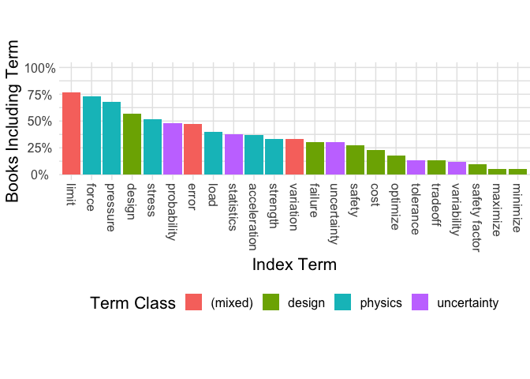

Analyze Textbook Index Terms
================

A term that appears in the index of a textbook has been selected by the
author as a subject to highlight and make more accessible to the reader.
In this sense, a term in the index is “important.”

# Setup

Load necessary packages and hard-code data locations. Note that the
data-loading chunks below assume you have run the textbook scraper
locally (i.e., that `masterlist.csv` is ready to go).

``` r
library(tidyverse)
```

    ## ── Attaching packages ─────────────────────────────────────── tidyverse 1.3.0 ──

    ## ✔ ggplot2 3.4.0      ✔ purrr   1.0.1 
    ## ✔ tibble  3.1.8      ✔ dplyr   1.0.10
    ## ✔ tidyr   1.2.1      ✔ stringr 1.5.0 
    ## ✔ readr   2.1.3      ✔ forcats 0.5.2

    ## ── Conflicts ────────────────────────────────────────── tidyverse_conflicts() ──
    ## ✖ dplyr::filter() masks stats::filter()
    ## ✖ dplyr::lag()    masks stats::lag()

``` r
library(googlesheets4)
filename <- "../data_proc/masterlist.csv"
url_metadata <- "https://docs.google.com/spreadsheets/d/1n_fFptcgPIzzlNYHkUblP_cReWGNo3TKGJ-Bo7W5oA0/edit#gid=0"
url_manual <- "https://docs.google.com/spreadsheets/d/1TMl_vxOytHYPd9_CAJoJNJAkbWnj9FMUtxLg5R8ufyo/edit#gid=0"
```

Authenticate your Google account for Google Sheets access.

## Load metadata

Load the book metadata from our shared Google Sheet.

``` r
df_meta_raw <- read_sheet(
    url_metadata, col_types = str_c(c("cccc", rep("?", 19)), collapse = "")
  )
```

    ## ✔ Reading from "textbook-review".

    ## ✔ Range 'Included Textbooks'.

    ## New names:
    ## • `` -> `...21`
    ## • `` -> `...22`
    ## • `` -> `...23`

``` r
df_meta_raw %>%
  glimpse()
```

    ## Rows: 1,004
    ## Columns: 23
    ## $ Author          <chr> "<NA>", "Anderson", "Anderson, John D.", "Ang, Alfredo…
    ## $ Title           <chr> "AISC Manual of Steel Construction: Allowable Stress D…
    ## $ `ISBN 13`       <chr> NA, "9781260471441", "9780078027673", "9780471720645",…
    ## $ Assigned        <chr> "AJ", "KD", "ZDR", "AJ", "KD", "ZDR", "ZDR", "(ZDR)", …
    ## $ `PDF Stored`    <lgl> FALSE, TRUE, TRUE, FALSE, TRUE, TRUE, TRUE, TRUE, TRUE…
    ## $ `OCR Needed`    <lgl> FALSE, TRUE, FALSE, FALSE, FALSE, FALSE, FALSE, FALSE,…
    ## $ Courselist      <lgl> FALSE, TRUE, FALSE, TRUE, TRUE, TRUE, TRUE, TRUE, FALS…
    ## $ `Procured?`     <lgl> FALSE, TRUE, TRUE, FALSE, TRUE, TRUE, TRUE, TRUE, TRUE…
    ## $ `ILL Needed`    <lgl> FALSE, FALSE, FALSE, TRUE, FALSE, FALSE, FALSE, FALSE,…
    ## $ `No Index`      <lgl> FALSE, FALSE, FALSE, FALSE, FALSE, FALSE, FALSE, FALSE…
    ## $ Inclusion       <chr> "Exclude", "Include", "Include", "Include", "Include",…
    ## $ `ISBN 10`       <chr> "1564240002", "1260471446", "71238182", "047172064X", …
    ## $ `Has Index?`    <lgl> FALSE, FALSE, FALSE, FALSE, FALSE, FALSE, FALSE, FALSE…
    ## $ `On Knovel?`    <lgl> FALSE, FALSE, FALSE, FALSE, FALSE, FALSE, FALSE, FALSE…
    ## $ `Known Courses` <chr> "CE 426 (NCSU)", "Compressible Flows (UCLA)", "AERO201…
    ## $ Year            <dbl> NA, 2020, NA, 2006, 2011, NA, NA, NA, 2015, NA, NA, NA…
    ## $ Type            <chr> NA, NA, "Foundation", NA, NA, NA, NA, NA, NA, NA, "Fou…
    ## $ Discipline      <chr> "CEE", "Aero", "Aero", "CEE", "CEE", "ME", "ME", NA, N…
    ## $ Link            <chr> "XX - Interlibrary loan?", "https://icourse.club/uploa…
    ## $ Notes           <chr> NA, "*3rd edition instead of 4th", NA, NA, NA, "Vector…
    ## $ ...21           <lgl> NA, NA, NA, NA, NA, NA, NA, NA, NA, NA, NA, NA, NA, NA…
    ## $ ...22           <chr> NA, NA, NA, NA, NA, NA, NA, NA, NA, NA, NA, NA, NA, NA…
    ## $ ...23           <dbl> NA, NA, NA, NA, NA, NA, NA, NA, NA, NA, NA, NA, NA, NA…

Process the metadata.

``` r
df_meta <-
  df_meta_raw %>%
  select(
    authors = Author,
    title = Title,
    ISBN = `ISBN 13`,
    courselist = Courselist,
    known_courses = `Known Courses`,
    need_ocr = `OCR Needed`,
    include = Inclusion,
    have_pdf = `PDF Stored`,
    no_index = `No Index`,
  ) %>%
  mutate(
    include = include == "Include",
    courselist_institution = str_extract(known_courses, "\\([\\w|\\s]+\\)$") %>%
      str_remove_all(., "[:punct:]"),
  ) %>%
  filter(!is.na(authors))
df_meta
```

    ## # A tibble: 103 × 10
    ##    authors   title ISBN  cours…¹ known…² need_…³ include have_…⁴ no_in…⁵ cours…⁶
    ##    <chr>     <chr> <chr> <lgl>   <chr>   <lgl>   <lgl>   <lgl>   <lgl>   <chr>  
    ##  1 <NA>      AISC… <NA>  FALSE   CE 426… FALSE   FALSE   FALSE   FALSE   NCSU   
    ##  2 Anderson  Mode… 9781… TRUE    Compre… TRUE    TRUE    TRUE    FALSE   UCLA   
    ##  3 Anderson… Intr… 9780… FALSE   AERO20… FALSE   TRUE    TRUE    FALSE   TAMU   
    ##  4 Ang, Alf… Prob… 9780… TRUE    Probab… FALSE   TRUE    FALSE   FALSE   MIT    
    ##  5 Ashford,… Tech… 9780… TRUE    Techno… FALSE   TRUE    TRUE    FALSE   MIT    
    ##  6 Beer      Vect… 9780… TRUE    Engine… FALSE   TRUE    TRUE    FALSE   SUNY P…
    ##  7 Bergman,… Fund… 9781… TRUE    ME 343… FALSE   TRUE    TRUE    FALSE   CalPoly
    ##  8 Bergman,… Fund… 9781… TRUE    (CMU)   FALSE   TRUE    TRUE    FALSE   CMU    
    ##  9 Bergströ… Mech… 9780… FALSE   <NA>    FALSE   TRUE    TRUE    FALSE   <NA>   
    ## 10 Bevingto… Data… 9780… TRUE    Measur… TRUE    TRUE    TRUE    FALSE   MIT    
    ## # … with 93 more rows, and abbreviated variable names ¹​courselist,
    ## #   ²​known_courses, ³​need_ocr, ⁴​have_pdf, ⁵​no_index, ⁶​courselist_institution

## Load scraped PDF data

This comes from the locally-stored `masterlist.csv` file.

``` r
df_raw <- read_csv(
  filename,
  col_types = "cc"
)
df_raw
```

    ## # A tibble: 223,664 × 2
    ##    Term                            ISBN         
    ##    <chr>                           <chr>        
    ##  1 "726 Index"                     9780521883030
    ##  2 "Virtual movement"              9780521883030
    ##  3 "see also"                      9780521883030
    ##  4 "virtual displacement"          9780521883030
    ##  5 "Virtual work"                  9780521883030
    ##  6 "x–xi"                          9780521883030
    ##  7 "for a rolling body"            9780521883030
    ##  8 "principle of"                  9780521883030
    ##  9 "in con\ue01eguration space"    9780521883030
    ## 10 "in terms of quasi-coordinates" 9780521883030
    ## # … with 223,654 more rows

## Load manual data

``` r
df_manual_raw <- read_sheet(
  url_manual,
  col_types = str_c(c("cccc", rep("?", 22)), collapse = "")
)
```

    ## ✔ Reading from "index-keywords".

    ## ✔ Range 'Sheet1'.

``` r
df_manual_raw %>%
  glimpse()
```

    ## Rows: 21
    ## Columns: 26
    ## $ Authors                             <chr> "Anderson", "Ang", "Bevington, Phi…
    ## $ Title                               <chr> "Modern compressible flow : with h…
    ## $ `ISBN-13`                           <chr> "9781260471441", "9780471720645", …
    ## $ Assigned                            <chr> "AJ", "KD", "AJ", "AJ", "AJ", "AJ"…
    ## $ acceleration                        <chr> "N", "N", "N", "N", "N", "Y", NA, …
    ## $ cost                                <chr> "N", "N", "N", "N", "N", "N", NA, …
    ## $ design                              <chr> "N", "N", "N", "N", "N", "Y", NA, …
    ## $ error                               <chr> "Y", "Y", "Y", "N", "N", "N", NA, …
    ## $ `failure\n/ fail`                   <chr> "N", "N", "N", "N", "N", "N", NA, …
    ## $ force                               <chr> "Y", "N", "N", "N", "N", "Y", NA, …
    ## $ limit                               <chr> "Y", "Y", "Y", "Y", "N", "Y", NA, …
    ## $ load                                <chr> "N", "N", "N", "N", "N", "N", NA, …
    ## $ `maximize\n/ maximization`          <chr> "N", "N", "Y", "N", "N", "N", NA, …
    ## $ `minimize\n/ minimization`          <chr> "N", "N", "Y", "N", "N", "N", NA, …
    ## $ `optimize\n/ optimization`          <chr> "N", "N", "N", "N", "N", "N", NA, …
    ## $ pressure                            <chr> "Y", "N", "N", "N", "N", "Y", NA, …
    ## $ `probability\n/ probabilities`      <chr> "Y", "Y", "Y", "N", "N", "N", NA, …
    ## $ safety                              <chr> "N", "N", "N", "N", "N", "N", NA, …
    ## $ `safety factor\n/ factor of safety` <chr> "N", "N", "N", "N", "N", "N", NA, …
    ## $ statistic                           <chr> "Y", "Y", "Y", "N", "N", "Y", NA, …
    ## $ strength                            <chr> "N", "N", "N", "N", "N", "N", NA, …
    ## $ stress                              <chr> "N", "N", "N", "N", "N", "N", NA, …
    ## $ tolerance                           <chr> "N", "N", "Y", "N", "N", "N", NA, …
    ## $ `tradeoff\n/ trade`                 <chr> "N", "N", "N", "N", "N", "N", NA, …
    ## $ `uncertainty\n/ uncertain`          <chr> "N", "Y", "Y", "N", "Y", "Y", NA, …
    ## $ variability                         <chr> "N", "Y", "N", "N", "N", "N", NA, …

Process manual data

``` r
df_manual <-
  df_manual_raw %>%
  pivot_longer(
    cols = -c(Authors, Title, `ISBN-13`, Assigned),
    names_to = "term",
    values_to = "PRESENT"
  ) %>%
  filter(PRESENT == "Y") %>%
  mutate(
    term = str_remove(term, "\\n.*$")
  ) %>%
  select(
    term,
    ISBN = `ISBN-13`,
  )

df_manual
```

    ## # A tibble: 117 × 2
    ##    term        ISBN         
    ##    <chr>       <chr>        
    ##  1 error       9781260471441
    ##  2 force       9781260471441
    ##  3 limit       9781260471441
    ##  4 pressure    9781260471441
    ##  5 probability 9781260471441
    ##  6 statistic   9781260471441
    ##  7 error       9780471720645
    ##  8 limit       9780471720645
    ##  9 probability 9780471720645
    ## 10 statistic   9780471720645
    ## # … with 107 more rows

``` r
df_manual %>%
  distinct(ISBN) %>%
  count()
```

    ## # A tibble: 1 × 1
    ##       n
    ##   <int>
    ## 1    18

## Process term data

Process the Index term data and join with manual data.

``` r
df_data <-
  df_raw %>%
  rename(term = Term) %>%
  # Atomize to single words
  # separate_rows(term) %>%
  # Lowercase
  mutate(term = str_to_lower(term)) %>%
  bind_rows(df_manual)

df_data
```

    ## # A tibble: 223,781 × 2
    ##    term                            ISBN         
    ##    <chr>                           <chr>        
    ##  1 "726 index"                     9780521883030
    ##  2 "virtual movement"              9780521883030
    ##  3 "see also"                      9780521883030
    ##  4 "virtual displacement"          9780521883030
    ##  5 "virtual work"                  9780521883030
    ##  6 "x–xi"                          9780521883030
    ##  7 "for a rolling body"            9780521883030
    ##  8 "principle of"                  9780521883030
    ##  9 "in con\ue01eguration space"    9780521883030
    ## 10 "in terms of quasi-coordinates" 9780521883030
    ## # … with 223,771 more rows

## Sanity-check available PDFs

Are any of the fully-digital PDFs unaccounted?

``` r
df_meta %>%
  filter(include, have_pdf, !need_ocr) %>%
  distinct(ISBN, .keep_all = TRUE) %>%
  anti_join(df_data, by = "ISBN")
```

    ## # A tibble: 0 × 10
    ## # … with 10 variables: authors <chr>, title <chr>, ISBN <chr>,
    ## #   courselist <lgl>, known_courses <chr>, need_ocr <lgl>, include <lgl>,
    ## #   have_pdf <lgl>, no_index <lgl>, courselist_institution <chr>

- No unaccounted fully-digital books!

I’ve used the chunk above to track down “missing” PDFs; most of these
were due to ISBN’s that did not match between the PDF filename and the
metadata (Google) sheet.

## Need OCR

Which books do we need to run through OCR?

``` r
df_meta %>%
  filter(include, have_pdf, need_ocr) %>%
  select(authors, title)
```

    ## # A tibble: 15 × 2
    ##    authors                           title                                      
    ##    <chr>                             <chr>                                      
    ##  1 Anderson                          Modern compressible flow : with historical…
    ##  2 Bevington, Philip R. and Robinson Data reduction and error analysis for the …
    ##  3 Buckmaster, Ludford               Theory of Laminar Flames                   
    ##  4 Callen, Herbert B.                Thermodynamics and an introduction to ther…
    ##  5 Cannon                            Dynamics of Physical Systems               
    ##  6 Ching                             Building Construction Illustrated 6th Ed.  
    ##  7 Craig                             Introduction to Robotics: Mechanics and Co…
    ##  8 Cravalho, Ernest G.               Engineering thermodynamics                 
    ##  9 Gould, Tobochnik                  Statistical and Thermal Physics: With Comp…
    ## 10 Holtz, Kovacs, Sheahan            An introduction to geotechnical engineerin…
    ## 11 Kittel, Kroemer                   Thermal Physics 2nd ed.                    
    ## 12 Limbrunner                        Applied Statics and Strength of Materials  
    ## 13 McQuarrie, Donald A.              Statistical mechanics                      
    ## 14 Speyer, Chung                     Stochastic Processes, Estimation, and Cont…
    ## 15 Strogatz, Steven Henry            Nonlinear dynamics and chaos: with applica…

Do we have all OCR books in our manual list?

``` r
df_meta %>%
  filter(include, need_ocr) %>%
  anti_join(df_manual_raw, by = c("ISBN" = "ISBN-13"))
```

    ## # A tibble: 1 × 10
    ##   authors    title ISBN  cours…¹ known…² need_…³ include have_…⁴ no_in…⁵ cours…⁶
    ##   <chr>      <chr> <chr> <lgl>   <chr>   <lgl>   <lgl>   <lgl>   <lgl>   <chr>  
    ## 1 Moran, Sh… Fund… 9780… TRUE    (CMU)   TRUE    TRUE    FALSE   FALSE   CMU    
    ## # … with abbreviated variable names ¹​courselist, ²​known_courses, ³​need_ocr,
    ## #   ⁴​have_pdf, ⁵​no_index, ⁶​courselist_institution

- We don’t have Moran & Shapiro 7th ed, but we do have the 6th ed

Do we have all OCR books coded?

``` r
df_manual_raw %>%
  filter(if_all(everything(), ~!is.na(.x))) %>% 
  anti_join(
    df_manual_raw,
    .,
    by = "ISBN-13"
  )
```

    ## # A tibble: 3 × 26
    ##   Authors   Title ISBN-…¹ Assig…² accel…³ cost  design error failu…⁴ force limit
    ##   <chr>     <chr> <chr>   <chr>   <chr>   <chr> <chr>  <chr> <chr>   <chr> <chr>
    ## 1 Carryer,… Intr… 978013… AJ      <NA>    <NA>  <NA>   <NA>  <NA>    <NA>  <NA> 
    ## 2 Moran/sh… Fund… 978111… ZDR     <NA>    <NA>  <NA>   <NA>  <NA>    <NA>  <NA> 
    ## 3 Turns, H… An i… 978126… ZDR     <NA>    <NA>  <NA>   <NA>  <NA>    <NA>  <NA> 
    ## # … with 15 more variables: load <chr>, `maximize\n/ maximization` <chr>,
    ## #   `minimize\n/ minimization` <chr>, `optimize\n/ optimization` <chr>,
    ## #   pressure <chr>, `probability\n/ probabilities` <chr>, safety <chr>,
    ## #   `safety factor\n/ factor of safety` <chr>, statistic <chr>, strength <chr>,
    ## #   stress <chr>, tolerance <chr>, `tradeoff\n/ trade` <chr>,
    ## #   `uncertainty\n/ uncertain` <chr>, variability <chr>, and abbreviated
    ## #   variable names ¹​`ISBN-13`, ²​Assigned, ³​acceleration, ⁴​`failure\n/ fail`

- Carrier et al.: We have a hardcopy somewhere… working on it
- Moran & Shapiro: Edition mismatch
- Turns & Haworth: ILL placed, still waiting

## Special cases

``` r
df_data %>%
  semi_join(
    .,
    df_meta %>%
      filter(
        # str_detect(authors, "Kerrebrock"), # Scraper throws weird msg
        ISBN == "9780471947219" # Sheppard & Tongue; OCR'd at library
      ),
    by = "ISBN"
  )
```

    ## # A tibble: 2,290 × 2
    ##    term                     ISBN         
    ##    <chr>                    <chr>        
    ##  1 index 635                9780471947219
    ##  2 foot as unit of length   9780471947219
    ##  3 overview                 9780471947219
    ##  4 pound as unit of force 7 9780471947219
    ##  5 second as unit of time   9780471947219
    ##  6 slug as unit of mass     9780471947219
    ##  7 table of standard units  9780471947219
    ##  8 v                        9780471947219
    ##  9 varignon's theorem       9780471947219
    ## 10 vector addition:         9780471947219
    ## # … with 2,280 more rows

## Missing digitized indexes

Are any books missing from the digitized corpus?

``` r
df_meta %>%
  filter(include, courselist, !need_ocr, !no_index) %>%
  anti_join(df_data, by = "ISBN") %>%
  select(title, everything())
```

    ## # A tibble: 0 × 10
    ## # … with 10 variables: title <chr>, authors <chr>, ISBN <chr>,
    ## #   courselist <lgl>, known_courses <chr>, need_ocr <lgl>, include <lgl>,
    ## #   have_pdf <lgl>, no_index <lgl>, courselist_institution <chr>

- No missing digitized indices

## Missing any books

``` r
df_meta %>% 
  filter(include, courselist) %>%
  anti_join(df_data, by = "ISBN")
```

    ## # A tibble: 6 × 10
    ##   authors    title ISBN  cours…¹ known…² need_…³ include have_…⁴ no_in…⁵ cours…⁶
    ##   <chr>      <chr> <chr> <lgl>   <chr>   <lgl>   <lgl>   <lgl>   <lgl>   <chr>  
    ## 1 Carryer, … Intr… 9780… TRUE    (CMU)   TRUE    TRUE    FALSE   FALSE   CMU    
    ## 2 Gonzalez … Geol… 9780… TRUE    Engine… FALSE   TRUE    FALSE   TRUE    UCLA   
    ## 3 Moran, Sh… Fund… 9780… TRUE    (CMU)   TRUE    TRUE    FALSE   FALSE   CMU    
    ## 4 Moran/sha… Fund… 9781… TRUE    ME 302… TRUE    TRUE    FALSE   FALSE   CalPoly
    ## 5 Moran/sha… Fund… 9781… TRUE    Introd… TRUE    TRUE    FALSE   FALSE   UCLA   
    ## 6 Turns, Ha… An i… 9781… TRUE    Fluid … TRUE    TRUE    FALSE   FALSE   UCLA   
    ## # … with abbreviated variable names ¹​courselist, ²​known_courses, ³​need_ocr,
    ## #   ⁴​have_pdf, ⁵​no_index, ⁶​courselist_institution

- Gonzales & Ferrer: Has no Index section (DNE)

- Carryer et al.: In progress…

- Turns & Haworth: ILL placed…

- Moran & Shapiro: We have the 6th edition

# Analyze

## Write full list

``` r
df_meta %>%
  filter(include, courselist) %>%
  select(
    ISBN, courselist_institution, no_index
  ) %>%
  ## Compute artifact recovery
  left_join(
    df_data %>%
      distinct(ISBN) %>%
      mutate(recovered = TRUE)
  ) %>%
  replace_na(list(recovered = FALSE)) %>%
  arrange(courselist_institution) %>%
  rename(
    `Institution` = courselist_institution,
    `No Index` = no_index,
    Recovered = recovered,
  ) %>%
  write_csv("../data_proc/list_pub.csv")
```

    ## Joining, by = "ISBN"

## Describe corpus

### Courselist books

``` r
df_courselist_counts <-
  df_meta %>%
  filter(include, courselist) %>%
  count(courselist_institution) %>%
  arrange(desc(n)) %>%
  rename(
    Institution = courselist_institution,
    `Reserve Books` = n
  ) %>%
  mutate(
    Institution = str_replace(Institution, "CalPoly", "CalPoly SLO"),
  )

df_courselist_counts %>%
  knitr::kable()
```

| Institution | Reserve Books |
|:------------|--------------:|
| MIT         |            23 |
| CalPoly SLO |            17 |
| UCLA        |            17 |
| CMU         |             7 |
| SUNY Poly   |             5 |

``` r
df_courselist_counts %>%
  summarize(n_total = sum(`Reserve Books`))
```

    ## # A tibble: 1 × 1
    ##   n_total
    ##     <int>
    ## 1      69

- the number of (double-counted) books listed across the 5 course
  reserve lists

### Unique corselist books

``` r
df_meta %>%
  filter(include, courselist, !no_index) %>%
  distinct(ISBN) %>%
  count()
```

    ## # A tibble: 1 × 1
    ##       n
    ##   <int>
    ## 1    64

- the number of unique books listed across the 5 course reserve lists

### Digital Index

``` r
df_meta %>%
  filter(include, courselist, !no_index, !need_ocr) %>%
  semi_join(df_data, by = "ISBN") %>%
  distinct(ISBN) %>%
  count()
```

    ## # A tibble: 1 × 1
    ##       n
    ##   <int>
    ## 1    45

- the number of fully-digital Index sections

### Manually-processed Indexes

``` r
df_meta %>%
  filter(include, courselist, !no_index, need_ocr) %>%
  semi_join(df_data, by = "ISBN") %>%
  distinct(ISBN) %>%
  count()
```

    ## # A tibble: 1 × 1
    ##       n
    ##   <int>
    ## 1    15

### No Index

``` r
df_meta %>%
  filter(include, courselist, no_index) %>%
  distinct(ISBN, .keep_all = TRUE)
```

    ## # A tibble: 1 × 10
    ##   authors    title ISBN  cours…¹ known…² need_…³ include have_…⁴ no_in…⁵ cours…⁶
    ##   <chr>      <chr> <chr> <lgl>   <chr>   <lgl>   <lgl>   <lgl>   <lgl>   <chr>  
    ## 1 Gonzalez … Geol… 9780… TRUE    Engine… FALSE   TRUE    FALSE   TRUE    UCLA   
    ## # … with abbreviated variable names ¹​courselist, ²​known_courses, ³​need_ocr,
    ## #   ⁴​have_pdf, ⁵​no_index, ⁶​courselist_institution

### Unobtained books

``` r
df_meta %>%
  filter(include, courselist, !no_index) %>%
  anti_join(df_data, by = "ISBN") %>%
  distinct(ISBN, .keep_all = TRUE)
```

    ## # A tibble: 4 × 10
    ##   authors    title ISBN  cours…¹ known…² need_…³ include have_…⁴ no_in…⁵ cours…⁶
    ##   <chr>      <chr> <chr> <lgl>   <chr>   <lgl>   <lgl>   <lgl>   <lgl>   <chr>  
    ## 1 Carryer, … Intr… 9780… TRUE    (CMU)   TRUE    TRUE    FALSE   FALSE   CMU    
    ## 2 Moran, Sh… Fund… 9780… TRUE    (CMU)   TRUE    TRUE    FALSE   FALSE   CMU    
    ## 3 Moran/sha… Fund… 9781… TRUE    ME 302… TRUE    TRUE    FALSE   FALSE   CalPoly
    ## 4 Turns, Ha… An i… 9781… TRUE    Fluid … TRUE    TRUE    FALSE   FALSE   UCLA   
    ## # … with abbreviated variable names ¹​courselist, ²​known_courses, ³​need_ocr,
    ## #   ⁴​have_pdf, ⁵​no_index, ⁶​courselist_institution

- Moran & Shapiro: We have a different edition
- Turns & Haworth: ILL request placed
- Carryer et al.: We have it somewhere….

### Most-occurring books

``` r
df_meta %>%
  filter(include, courselist) %>%
  count(ISBN) %>%
  arrange(desc(n)) %>%
  left_join(
    .,
    df_meta %>%
      distinct(ISBN, .keep_all = TRUE) %>%
      select(ISBN, title)
  )
```

    ## Joining, by = "ISBN"

    ## # A tibble: 65 × 3
    ##    ISBN              n title                                                    
    ##    <chr>         <int> <chr>                                                    
    ##  1 9780486652429     2 An Introduction to Statistical Thermodynamics            
    ##  2 9781118753651     2 Orbital Mechanics for engineering students 4th Ed.       
    ##  3 9781118989173     2 Fundamentals of heat and mass transfer 8th Ed.           
    ##  4 9781119721437     2 Fundamentals of Engineering Thermodynamics 9th. Ed       
    ##  5 9780072472271     1 Data reduction and error analysis for the physical scien…
    ##  6 9780073398242     1 Vector Mechanics for Engineers                           
    ##  7 9780073529288     1 Mechanical Engineering Design 9th Ed.                    
    ##  8 9780073529349     1 Fluid mechanics, 7th ed                                  
    ##  9 9780128150733     1 Exploring Engineering (4th ed.)                          
    ## 10 9780131433564     1 Introduction to Mechatronic Design 1st Edition           
    ## # … with 55 more rows

- at most, a particular textbook was listed 2x

## Statistics-related titles

### Full corpus

``` r
df_meta %>%
  filter(include, courselist) %>%
  summarize(
    n_total = n(),
    n_stats = sum(str_detect(str_to_lower(title), "statis|data"))
  ) %>%
  mutate(frac_stat = n_stats / n_total)
```

    ## # A tibble: 1 × 3
    ##   n_total n_stats frac_stat
    ##     <int>   <int>     <dbl>
    ## 1      69       7     0.101

### Missing books

``` r
df_meta %>%
  filter(include, courselist) %>%
  anti_join(df_data, by = "ISBN") %>%
  summarize(
    n_total = n(),
    n_stats = sum(str_detect(str_to_lower(title), "statis|data"))
  ) %>%
  mutate(frac_stat = n_stats / n_total)
```

    ## # A tibble: 1 × 3
    ##   n_total n_stats frac_stat
    ##     <int>   <int>     <dbl>
    ## 1       6       0         0

### Fisher exact test

``` r
## Set up contingency table
n_corpus_stats <-
  df_meta %>%
  filter(
    include,
    courselist,
    str_detect(str_to_lower(title), "statis|data")
  ) %>%
  semi_join(df_data, by = "ISBN") %>%
  count() %>%
  pull(n)

n_Ncorpus_stats <-
  df_meta %>%
  filter(
    include,
    courselist,
    str_detect(str_to_lower(title), "statis|data")
  ) %>%
  anti_join(df_data, by = "ISBN") %>%
  count() %>%
  pull(n)

n_corpus_Nstats <-
  df_meta %>%
  filter(
    include,
    courselist,
    !str_detect(str_to_lower(title), "statis|data")
  ) %>%
  semi_join(df_data, by = "ISBN") %>%
  count() %>%
  pull(n)

n_Ncorpus_Nstats <-
  df_meta %>%
  filter(
    include,
    courselist,
    !str_detect(str_to_lower(title), "statis|data")
  ) %>%
  anti_join(df_data, by = "ISBN") %>%
  count() %>%
  pull(n)

mat_counts <-
  matrix(
    c(n_corpus_stats, n_corpus_Nstats, n_Ncorpus_stats, n_Ncorpus_Nstats),
    nrow = 2
)
mat_counts
```

    ##      [,1] [,2]
    ## [1,]    7    0
    ## [2,]   56    6

``` r
## Run the test
fisher.test(mat_counts)
```

    ## 
    ##  Fisher's Exact Test for Count Data
    ## 
    ## data:  mat_counts
    ## p-value = 1
    ## alternative hypothesis: true odds ratio is not equal to 1
    ## 95 percent confidence interval:
    ##  0.1186631       Inf
    ## sample estimates:
    ## odds ratio 
    ##        Inf

The fraction of statistics-related titles among the missing books is not
significantly different from fraction in the corpus. **NO LONGER
RELEVANT** due to obtaining virtually every book….

## Count terms

### Definitions

The following code detects the presence of certain keywords in the
textbook indexes. The `count` represents the number of textbooks whose
index includes the keyword, while the `frac` represents the fraction (of
our available corpus) that includes the keyword.

Note that some of the terms are multiply-defined; for instance,
`tradeoff` is counted if either `trade` or `tradeoff` is detected in the
Index.

``` r
# Define search terms through helper functions
term_summaries <- list(
  ## Physics
  "acceleration" = ~max(str_detect(.x, "acceleration")),
  "force" = ~max(str_detect(.x, "force")),
  "load" = ~max(str_detect(.x, "load")),
  "pressure" = ~max(str_detect(.x, "pressure")),
  "strength" = ~max(str_detect(.x, "strength")),
  "stress" = ~max(str_detect(.x, "stress")),
  ## Engineering design
  "cost" = ~max(str_detect(.x, "cost")),
  "design" = ~max(str_detect(.x, "design")),
  "failure" = ~max(str_detect(.x, "failure|fail")),
  "maximize" = ~max(str_detect(.x, "maximize|maximization")),
  "minimize" = ~max(str_detect(.x, "minimize|minimization")),
  "optimize" = ~max(str_detect(.x, "optimize|optimization")),
  "safety" = ~max(str_detect(.x, "safety")),
  "safety factor" = ~max(str_detect(.x, "safety factor|factor of safety")),
  "tradeoff" = ~max(str_detect(.x, "tradeoff|trade")),
  ## Uncertainty
  "error" = ~max(str_detect(.x, "error")),
  "probability" = ~max(str_detect(.x, "probability|probabilities")),
  "statistics" = ~max(str_detect(.x, "statistic")),
  "tolerance" = ~max(str_detect(.x, "tolerance")),
  "uncertainty" = ~max(str_detect(.x, "uncertainty|uncertain")),
  "variability" = ~max(str_detect(.x, "variability")),
  ## Mixed / ambiguous
  "variation" = ~max(str_detect(.x, "variation")),
  "limit" = ~max(str_detect(.x, "limit"))
)

df_classes <- tribble(
  ~term, ~class,
  "acceleration", "physics",
  "force", "physics",
  "load", "physics",
  "pressure", "physics",
  "strength", "physics",
  "stress", "physics",

  "cost", "design",
  "design", "design",
  "failure", "design",
  "maximize", "design",
  "minimize", "design",
  "optimize", "design",
  "safety", "design",
  "safety factor", "design",
  "tradeoff", "design",

  ## Uncertainty
  "probability", "uncertainty",
  "statistics", "uncertainty",
  "tolerance", "uncertainty",
  "uncertainty", "uncertainty",
  "variability", "uncertainty",

  ## Mixed use
  "error", "(mixed)",
  "variation", "(mixed)",
  "limit", "(mixed)",
)
```

### Run count

``` r
# Run analysis
df_counts <-
  df_data %>%
  semi_join(
    .,
    df_meta %>%
      filter(include, courselist),
    by = "ISBN"
  ) %>%
  group_by(ISBN) %>%
  summarize(across(term, term_summaries)) %>%
  summarize(
    across(-ISBN, sum),
    total = n()
  ) %>%
  pivot_longer(
    cols = -total,
    names_to = "term",
    values_to = "count"
  ) %>%
  mutate(
    term = str_remove_all(term, "term_"),
    frac = round(count / total, digits = 2)
  ) %>%
  arrange(desc(count)) %>%
  left_join(df_classes) %>%
  select(term, class, count, frac)
```

    ## Joining, by = "term"

``` r
df_counts %>%
  knitr::kable()
```

| term          | class       | count | frac |
|:--------------|:------------|------:|-----:|
| limit         | (mixed)     |    46 | 0.77 |
| force         | physics     |    44 | 0.73 |
| pressure      | physics     |    41 | 0.68 |
| design        | design      |    34 | 0.57 |
| stress        | physics     |    31 | 0.52 |
| probability   | uncertainty |    29 | 0.48 |
| error         | (mixed)     |    28 | 0.47 |
| load          | physics     |    24 | 0.40 |
| statistics    | uncertainty |    23 | 0.38 |
| acceleration  | physics     |    22 | 0.37 |
| strength      | physics     |    20 | 0.33 |
| variation     | (mixed)     |    20 | 0.33 |
| failure       | design      |    18 | 0.30 |
| uncertainty   | uncertainty |    18 | 0.30 |
| safety        | design      |    16 | 0.27 |
| cost          | design      |    14 | 0.23 |
| optimize      | design      |    11 | 0.18 |
| tradeoff      | design      |     8 | 0.13 |
| tolerance     | uncertainty |     8 | 0.13 |
| variability   | uncertainty |     7 | 0.12 |
| safety factor | design      |     6 | 0.10 |
| maximize      | design      |     3 | 0.05 |
| minimize      | design      |     3 | 0.05 |

``` r
## Visualize
ar = 1 / 4
df_counts %>%
  # filter(class != "(mixed)") %>%
  mutate(term = fct_reorder(term, -frac)) %>%

  ggplot(aes(term, frac)) +
  geom_col(aes(fill = class)) +
  # facet_grid(~class, scales = "free_x") +

  scale_y_continuous(
    limits = c(0, 1),
    labels = scales::label_percent(),
  ) +
  scale_fill_discrete(name = "Term Class") +
  rzdr::theme_common() +
  theme(
    axis.text.x = element_text(angle = 270, hjust = 0),
    legend.position = "bottom",
    # legend.direction = "vertical",
    aspect.ratio = ar,
  ) +
  labs(
    x = "Index Term",
    y = "Books Including Term",
  )
```

<!-- -->

``` r
ggsave(
  "../images/textbooks-terms.png",
  width = 8,
  height = 5,
  bg = "white"
)
```

*Observations*

- Physics-related terms dominate the list; `force` is important in the
  vast majority of engineering textbooks (0.73).
- Uncertainty-related terms appear less frequently:
  - `probability` is important in 0.48 of textbooks. This is similar to
    `frac` of `strength`
  - `uncertainty` is important in 0.3 of textbooks. This is similar to
    `frac` of `optimize`
  - `tolerance` is important in 0.13 of textbooks. This is a very small
    fraction, but `tolerance` is quite a bit more specific than
    something like `uncertainty`
- “Error” shows up an intermediate number of times, but as EF has shown,
  the term has a highly-variable meaning to practicing engineers.
  - `error` is important in 0.47 of textbooks

## Relative occurrence

``` r
## Extract counts
n_force <- df_counts %>% 
  filter(term == "force") %>% 
  pull(count)

df_counts %>% 
  mutate(r = round(n_force / count, 2)) %>% 
  select(term, class, r) %>% 
  
  filter(term %in% c("uncertainty", "statistics", "tolerance", "safety factor"))
```

    ## # A tibble: 4 × 3
    ##   term          class           r
    ##   <chr>         <chr>       <dbl>
    ## 1 statistics    uncertainty  1.91
    ## 2 uncertainty   uncertainty  2.44
    ## 3 tolerance     uncertainty  5.5 
    ## 4 safety factor design       7.33

## Count categories

How many books contain *any* keyword from one of the categories?

``` r
# Run analysis
df_count_classes <-
  df_data %>%
  semi_join(
    .,
    df_meta %>%
      filter(include, courselist),
    by = "ISBN"
  ) %>%
  group_by(ISBN) %>%
  summarize(across(term, term_summaries)) %>% 
  pivot_longer(
    cols = -ISBN,
    names_to = "term",
    values_to = "present"
  ) %>% 
  mutate(term = str_remove(term, "term_")) %>% 
  left_join(
    df_classes
  ) %>% 
  group_by(class, ISBN) %>% 
  summarize(present = max(present)) %>% 
  summarize(n = sum(present)) %>% 
  arrange(desc(n))
```

    ## Joining, by = "term"
    ## `summarise()` has grouped output by 'class'. You can override using the
    ## `.groups` argument.

``` r
df_count_classes
```

    ## # A tibble: 4 × 2
    ##   class           n
    ##   <chr>       <int>
    ## 1 (mixed)        54
    ## 2 physics        49
    ## 3 uncertainty    41
    ## 4 design         40
